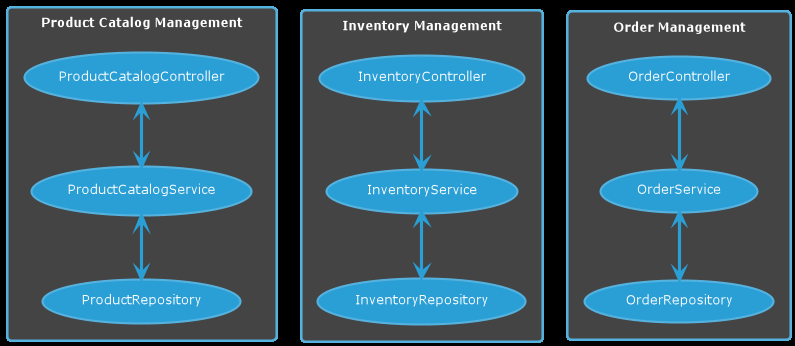
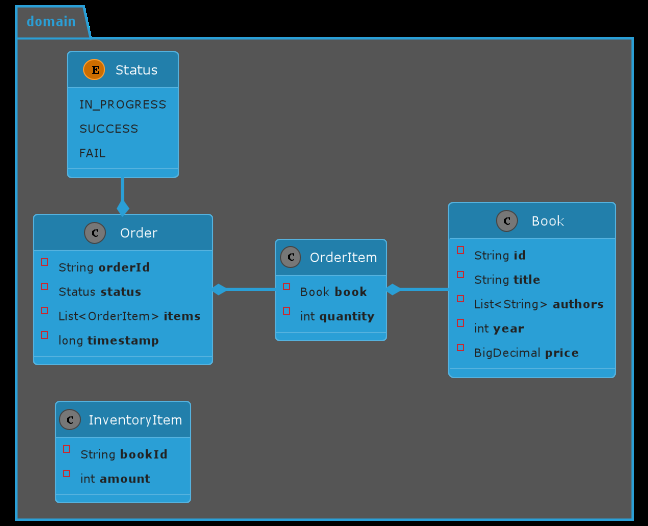
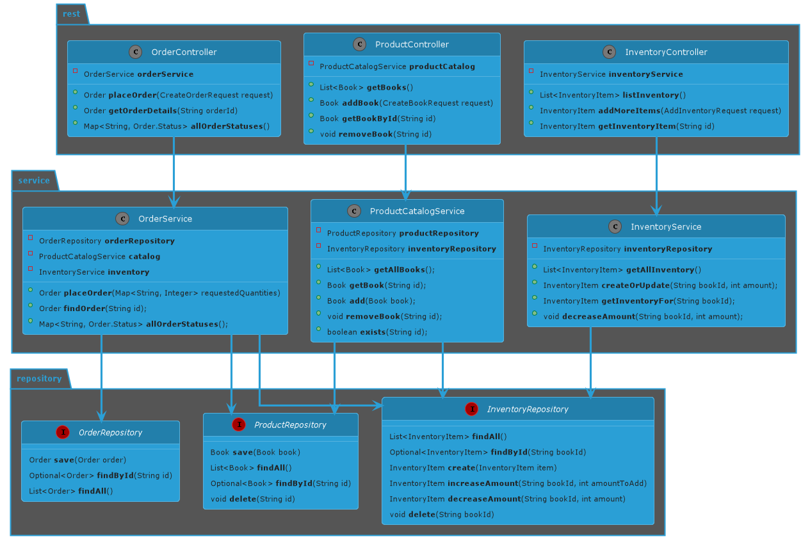

# Logical Book Store Project

This is a book store application, written in Java and Spring Boot for the purpose of interviewing candidates.

## Project Overview

Logical Book Store application is a software for managing an imaginary online book store.
It has three APIs that allow you to:
* Manage Product Catalog - add and remove books, view what books are available;
* Manage Inventory - add more items for the positions available in Product Catalog;
* Manage Orders - place orders for available items and view order history.



## Prerequisites
* Java 11 or above
* Postman or its analog for testing purposes. You can use a pre-created Postman collection `Logical Book Store Collection.postman_collection.json` for convenience. 

## Running the application

To start the application, run the `main` method in the `BookStoreApplication` class.

## Domain Model

Application aims to help in selling `Books`. Each `Book` type has an id that is globally unique and comes from an external third-party system. 

Class `InventoryItem` tracks the number of book copies the system has for each book (by `bookId`).

The system allows to place an `Order` for an existing `Book`, if we have enough of that book in the inventory.



There is a controller, a service and in a trivial in-memory database implementation for each core domain object (`Book`, `InventoryItem` and `Order`).
Those allow you to manage product catalog, replenish inventory, and place orders.



## Rest API

### Managing Product Catalog

1. Get all books in the Product Catalog
```    
curl --request GET \
--url http://localhost:8080/book-store/catalog/books \
--header 'Accept: application/json' \
--header 'Content-Type: application/json'
```

2. Add a new book to Catalog
```
curl --request POST \
--url http://localhost:8080/book-store/catalog/books \
--header 'Accept: application/json' \
--header 'Content-Type: application/json' \
--data '{
  "id": "4000",
  "title": "Working Effectively with Legacy Code",
  "authors": [
    "Michael Feathers"
  ],
  "year": 2004,
  "price": 37.49
}'
```
Creating a book should also create an empty InventoryItem for that book.

3. Get book by ID
```
curl --request GET \
--url http://localhost:8080/book-store/catalog/books/4000 \
--header 'Accept: application/json' \
--header 'Content-Type: application/json'
```

4. Delete book from Product Catalog
```
curl --request DELETE \
--url http://localhost:8080/book-store/catalog/books/1000 \
--header 'Accept: application/json' \
--header 'Content-Type: application/json'
```
Deleting the book should also automatically delete the inventory associated with that book.

### Managing Inventory
1. Get all existing inventory
```
curl --request GET \
--url http://localhost:8080/book-store/inventory \
--header 'Accept: application/json' \
--header 'Content-Type: application/json'
```
2. Get inventory item by id of the book
```
curl --request GET \
--url http://localhost:8080/book-store/inventory/4000 \
--header 'Accept: application/json' \
--header 'Content-Type: application/json'
```
3. Replenish inventory for one of the books in the Product Catalog 
```
curl --request POST \
--url http://localhost:8080/book-store/inventory/ \
--header 'Accept: application/json' \
--header 'Content-Type: application/json' \
--data '{
  "bookId": "4000",
  "amount": "10"
}'
```

### Order Management
1. Create a new order
```
curl --request POST \
--url http://localhost:8080/book-store/orders/ \
--header 'Content-Type: application/json' \
--data '{
  "items": [
    {
      "bookId": "1000",
      "quantity": 1
    },
    {
      "bookId": "3000",
      "quantity": 3
    }
  ]
}'
```
To place an order, book needs to exist in Product Catalog and there should be enough of it in the inventory.

2. Find order by ID
```
curl --request GET \
--url http://localhost:8080/book-store/orders/d257f630-9952-4cc3-9332-291ba8de8881 \
--header 'Content-Type: application/json'
```

3. Get order statuses
```
curl --request GET \
  --url http://localhost:8080/book-store/orders/ \
  --header 'Content-Type: application/json'
```
